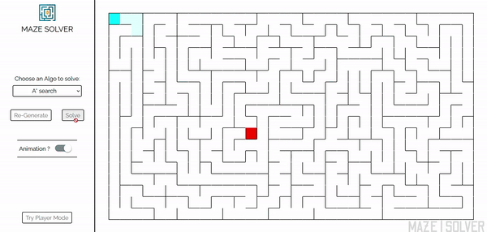

# Maze | Solver & Player

Collection of different algorithms to solve a maze and a simple maze game !

There are 3 steps in this process
1. Maze Generation
2. Player Mode
3. Maze Solution

## 1. Maze Generation

Algorithm used to generate Maze here is **Randomized depth-first search**

The steps are a follows:
1. Initialize Stack with the player position cell 
2. Get cell from top of the stack and select it as *current cell*
2. Mark it as visited
3. While Current cell has any unvisited neighbor cells
    1. Choose one of the unvisited neighbor
    2. Remove any wall of random choice
    3. Push it into the stack
    4. If all neighbors are visited pop the cell from stack 

## 2. Player Mode

 

Here you can control the player by using arrow keys on the keyboard to explore and get the feel of the grid.

## 3. Maze Solution

To solve the maze i.e. to take the player to food, we can use different algorithms and they are as follows.

### 1. Depth First search (DFS)

*Depth First Search (DFS)* is an edge-based technique. It uses the Stack data structure and performs two stages, first visited vertices are pushed into the stack, and second if there are no vertices then visited vertices are popped.

### 2. Breadth First search (BFS)

*Breadth First Search (BFS)* is a vertex-based technique for finding the shortest path in the graph. It uses a Queue data structure that follows first in first out. 
In BFS, one vertex is selected at a time when it is visited and marked then its adjacent are visited and stored in the queue.  

### 3. A star Search (A*)

A* is an extension of Dijkstra's algorithm with some characteristics of breadth-first search (BFS).

However, the A* algorithm introduces a **heuristic** into a regular graph-searching algorithm, essentially planning ahead at each step so a more optimal decision is made.

Here the Heuristic function that we use is the *Manhattan distance* between cell and food.

## Credits

- Icons: https://www.flaticon.com
- Gifs: https://ezgif.com/video-to-gif
- Definitions: https://www.geeksforgeeks.org/
 